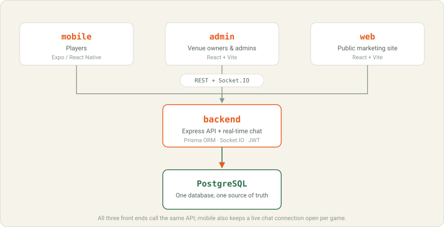

# gameOn — Project Overview

One page explaining what gameOn is, who it's for, how it's built, and what's
done vs. not — for anyone joining the project, technical or not. For setup
commands see [run.md](run.md); for the full technical reference see
[README.md](README.md).

## What it is

**gameOn** is a Playo-style app for booking sports venues and finding people
to play with. A player opens the app, finds a badminton court or a five-a-side
turf nearby, books a slot, splits the bill with friends, and — if they're
short a few players — posts the booking as an open game that other nearby
players can join. Venue owners get their own console to list courts, set
prices, and see bookings and revenue.

## Who uses it

| Person | What they do in gameOn |
|---|---|
| **Player** | Discovers venues and games nearby, books a court, splits the cost, hosts or joins pickup games, chats with the group, rates venues and players afterwards. |
| **Venue owner** | Lists their venue and courts, sets pricing per court, blocks out maintenance time, tracks bookings and revenue. |
| **Admin** | Same console as a venue owner, but sees every venue on the platform, not just their own. |

## The player journey

1. **Sign up** — phone number + OTP (or Google). No password to remember.
2. **Discover** — browse venues on a list or map, filtered by sport, price,
   rating, distance; browse open games looking for more players.
3. **Book** — pick a court and a time slot, see the live price, split the
   bill across friends by phone number, pay (or use the mock payment driver
   in dev).
4. **Play or host** — turn a booking into an open game so other players
   nearby can request to join; chat with the group in real time before
   the game.
5. **Afterwards** — rate the venue and the players you played with; earn
   reward points and a referral code to invite friends.

## How the product is built

Four apps share one backend and one database:

| App | What it's for | Built with |
|---|---|---|
| **mobile** | The player-facing app — the main product | Expo / React Native, works on iOS, Android, and web |
| **admin** | The venue-owner and admin console | React + Vite |
| **web** | Public marketing landing page | React + Vite |
| **backend** | The one API all three apps call, plus the real-time chat server | Node.js + Express, PostgreSQL via Prisma, Socket.IO |

Every external integration — SMS/OTP, payments, push notifications — sits
behind a small driver in the backend, defaulting to a mock driver that works
with no external accounts or API keys. Going live with a real provider
(Twilio, Razorpay, Stripe, FCM) is a config change, not a code change.

## What the data model is tracking

In plain terms, the database keeps track of:

- **Users** — players, venue owners, and admins; one table, a role field
  tells them apart.
- **Venues → Courts → Slots** — a venue has one or more courts (e.g. "Court
  1 — Badminton"), and each court's day is broken into bookable time slots
  generated on demand from the venue's opening hours.
- **Bookings → Splits** — a booking is one slot, paid by one or more people
  (the "splits").
- **Games → Players** — an open game tied to a booking (or standalone),
  with a roster of players who requested or joined.
- **Messages** — per-game group chat history.
- **Reviews** — ratings left on venues and on other players.
- **Notifications** — the in-app/push inbox.

## What's built vs. what's next

**Built (this MVP):**
- Phone OTP + Google sign-in, profile setup
- Venue discovery: list + map, filters, sort by distance/rating/price
- Venue detail with live slot availability
- Booking with bill-splitting and mock/real payment
- Find or host a game, with nearby-player invites, join/approve/leave
- Real-time group chat per game
- Booking history, ratings & reviews (venues and players)
- Referral codes and reward points
- Push and in-app notifications
- A full venue-owner console: listings, court pricing, calendar with slot
  blocking, bookings table, revenue/utilisation analytics

**Not built yet (phase 2):**
- Tournaments and leagues
- Coaching bookings
- A real wallet/loyalty ledger (today it's a simple point counter)
- A social feed of played games
- AI-based skill matching (today "invite nearby players" is a straightforward
  radius + skill-level filter, not a learned model)

## Known simplifications (by design, for MVP scope)

- Slot times assume a single timezone (server-local midnight) — fine for one
  region, would need a per-venue timezone column for multi-region.
- Apple sign-in is stubbed, not implemented (needs Apple's rotating JWKS to
  verify tokens); Google sign-in is fully wired.
- Stripe webhook signature verification needs the Stripe SDK; Razorpay's is
  fully implemented.
- Cancellation refunds use a simple fixed 12-hour cutoff.

## Where to go next

- **Run it locally**: [run.md](run.md) — step-by-step, or the one-line setup
  script after copying the environment files.
- **Full technical reference** (stack details, folder-by-folder structure,
  env vars, demo accounts): [README.md](README.md)
- **Data model**: [backend/prisma/schema.prisma](backend/prisma/schema.prisma)
- **API routes**: [backend/src/routes/](backend/src/routes/)

## full view ---  https://claude.ai/code/artifact/06c5a09d-e5c8-4c85-bac5-946c62372cdd?via=auto_preview

